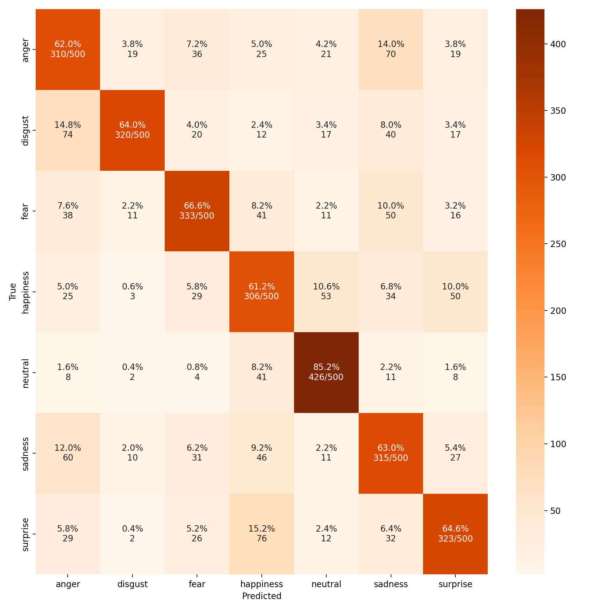

# Multilingual Emotional Classifier

This project trains and evaluates a multilingual emotion classifier (English + Spanish)
using DailyDialog and EmpatheticDialogues-derived CSV files.

This project develops a multilingual emotion recognition system (English and Spanish) that classifies user utterances into fine-grained emotional categories. The main goal is to move beyond traditional sentiment analysis, enabling dialogue systems to adapt their responses to the user's emotional state for a more empathetic and context-aware interaction. To achieve this, data from the *EmpatheticDialogues* and *DailyDialog* corpora were consolidated and processed, resulting in a robust dataset of over 360,000 interactions.

To address the natural class imbalance in the distribution of emotions, resampling techniques were implemented on the training set. Specifically, we applied downsampling to reduce the majority "neutral" class by 60%, and upsampling for minority classes such as disgust, surprise, and fear to ensure equitable representation. This strategy guarantees that the classifier learns to accurately distinguish both high-frequency and less common emotional states in both languages.

## Emotion Mapping

The system utilizes 7 normalized basic emotional categories. These are derived directly from the *DailyDialog* format, while the original 32 labels from *EmpatheticDialogues* were grouped and mapped into these seven categories, discarding ambiguous or underrepresented ones.

| Mapped Emotion | Original Labels (*EmpatheticDialogues*) |
| :--- | :--- |
| **Anger** | angry, annoyed, furious, jealous |
| **Disgust** | disgusted |
| **Fear** | afraid, anxious, apprehensive, terrified |
| **Happiness** | caring, confident, content, excited, faithful, grateful, joyful, hopeful, proud, trusting |
| **Sadness** | sad, ashamed, devastated, disappointed, embarrassed, guilty, lonely, nostalgic, sentimental |
| **Surprise** | impressed, surprised |
| **Removed** | anticipating, prepared |

## Dataset Source

The DAILYD and MPATHY CSV resources come from: [`CHANEL-JSALT-2020/datasets`](https://github.com/CHANEL-JSALT-2020/datasets)

The original notebook workflow (`emotional_classifier.ipynb`) has been split into
four scripts for a cleaner and reproducible pipeline:

- `prepare_data.py`
- `train.py`
- `evaluate.py`
- `predict.py`

Additionally, `benchmark.py` contains curated EN/ES benchmark sentences used by
`evaluate.py --run-benchmark` and `predict.py --run-benchmark`.

The notebook `emotional_classifier.ipynb` remains fully functional and can still be used.

## 1. Requirements

Install dependencies (preferably in a virtual environment):

```bash
pip install -r requirements.txt
```

## 2. Hyperparameter Config

The pipeline reads defaults from:

- `configs/hyperparameters.json`

You can edit this file to set dataset, training, and pipeline hyperparameters
without changing Python scripts.

Supported models are defined in the same JSON file under `train.allowed_models`:

```json
"allowed_models": [
	"google-bert/bert-base-multilingual-cased",
	"google-bert/bert-base-multilingual-uncased",
	"FacebookAI/xlm-roberta-base",
	"FacebookAI/xlm-roberta-large"
]
```

Use a custom config file path if needed:

```bash
CONFIG_FILE=configs/hyperparameters.json bash run_pipeline.sh
```

Environment variables still override JSON values when explicitly provided.

## 3. Data Preparation

Generate multilingual dataset and train/validation/test splits:

```bash
python3 prepare_data.py
```

Useful options:

```bash
python3 prepare_data.py --num-test 250 --num-val 250 --neutral-frac 0.6 --seed 42
```

Save distribution plots:

```bash
python3 prepare_data.py --save-plots
```

Outputs in `data/`:

- `dataset_multilingual_emotion.csv`
- `dataset_multi.csv` (legacy notebook-compatible filename)
- `train_dataset.csv`
- `val_dataset.csv`
- `test_dataset.csv`

Optional plot outputs in `data/plots/` when `--save-plots` is enabled.

## 4. Training

Train the classifier from prepared splits:

```bash
python3 train.py
```

Example with explicit model and output path:

```bash
python3 train.py \
	--model-name FacebookAI/xlm-roberta-large \
	--batch-size 32 \
	--epochs 3 \
	--learning-rate 5e-6
```

By default, artifacts are saved under `output/<model_name>`.
If needed, you can override with `--output-dir`.

Main artifacts saved under the resolved output directory:

- model weights and config
- tokenizer files
- `label_classes.npy`
- `eval_results.json`
- `classification_report.txt` (written by evaluation)
- timestamped run folders in `runs/run_YYYYMMDD_HHMMSS/` (logs + checkpoints)
- `runs/run_YYYYMMDD_HHMMSS/training_metrics.png`

Resume from latest checkpoint in `output/<model_name>/runs` (or `--output-dir/runs` if overridden):

```bash
python3 train.py --model-name FacebookAI/xlm-roberta-large --resume-from-checkpoint
```

## 5. Evaluation

Evaluate the trained model on the test split:

```bash
python3 evaluate.py --model-name FacebookAI/xlm-roberta-large
```

By default, the confusion matrix image is saved to:

- `output/<model_name>/plots/confusion_matrix.png`

Per-class metrics report is saved to:

- `output/<model_name>/classification_report.txt`

Run quick benchmark sets from `benchmark.py`:

```bash
python3 evaluate.py --model-name FacebookAI/xlm-roberta-large --run-benchmark
```

## 6. Prediction

Predict one or multiple texts:

```bash
python3 predict.py --model-name FacebookAI/xlm-roberta-large --text "Hola, ¿qué tal estás?"
```

Multiple texts:

```bash
python3 predict.py \
	--model-name FacebookAI/xlm-roberta-large \
	--text "I feel great today." \
	--text "Me siento genial hoy." \
	--text "I am worried about tomorrow." \
    --text "Estoy preocupado por el mañana."
```

From a file (one sentence per line):

```bash
python3 predict.py --model-name FacebookAI/xlm-roberta-large --text-file input_sentences.txt
```

Run benchmark quick sets with prediction path:

```bash
python3 predict.py --model-name FacebookAI/xlm-roberta-large --run-benchmark
```

## 7. Full Pipeline Script

Run the complete workflow with one command:

```bash
bash run_pipeline.sh
```

The pipeline executes all runtime scripts in order:

- `prepare_data.py`
- `train.py`
- `evaluate.py`
- `evaluate.py --run-benchmark`
- `predict.py --run-benchmark`

You can override model settings through environment variables:

```bash
MODEL_NAME=FacebookAI/xlm-roberta-large MODEL_DIR=output/FacebookAI/xlm-roberta-large bash run_pipeline.sh
```

Additional environment variables supported by `run_pipeline.sh`:

- `MODEL_DIR` (optional). If not provided, the pipeline uses `output/<MODEL_NAME>` by default.
- Legacy config value `pipeline.model_dir: "output/model"` is still accepted and automatically mapped to `output/<MODEL_NAME>`.

- `BATCH_SIZE` (default `32`)
- `EPOCHS` (default `3.0`)
- `LEARNING_RATE` (default `5e-6`)
- `DROPOUT` (default `0.2`)
- `SEED` (default `42`)
- `MAX_LENGTH` (default `128`)
- `SAVE_PLOTS` (`1`/`0`, default `1`)
- `RESUME_FROM_CHECKPOINT` (`1`/`0`, default `0`)

## Model Performance

Below is the performance comparison of the four multilingual models in two evaluation settings: (1) the multilingual test set (reporting Accuracy, macro-averaged F1, Precision, and Recall); and (2) the synthetic GPT-4 benchmark (reporting Accuracy for English and Spanish utterances to assess cross-lingual generalization).

| Model | Accuracy (%) | F1 | Precision | Recall | GPT-4 (ES) (%) | GPT-4 (EN) (%) |
| :--- | :---: | :---: | :---: | :---: | :---: | :---: |
| bert-cased | 54.57 | 0.54 | 0.55 | 0.55 | 72.91 | 70.81 |
| bert-uncased | 55.60 | 0.55 | 0.57 | 0.56 | 74.25 | 74.16 |
| xlm-roberta-base | 60.34 | 0.60 | 0.61 | 0.60 | 82.61 | 76.17 |
| **xlm-roberta-large** | **68.11** | **0.68** | **0.69** | **0.68** | **85.95** | **79.19** |

## Confusion Matrix (xlm-roberta-large)

The following confusion matrix illustrates the behavior of the `xlm-roberta-large` model on the GPT-4 generated test set, highlighting the areas where the model succeeds and where it tends to confuse the different emotional labels.



## Citation

This work is detailed in **Section 4.4.3 (User Emotion Recognition)** of the following PhD dissertation. If you use this project or dataset, please cite:

> **Personal Assistant with Emotional and Multilingual Capabilities for Social Robots**
> **M. Rodríguez-Cantelar**
> PhD Dissertation, Universidad Politécnica de Madrid [(UPM)](https://oa.upm.es/91661/), 2025